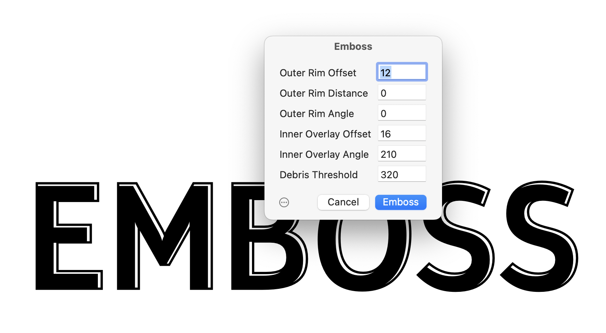

# Emboss

Glyphs.app plug-in for creating an embossed/beveled effect:

### Installation

1. In *Window > Plugin Manager*, click the *Install* button next to the *Emboss* entry.
2. Restart Glyphs

### Usage Instructions

Run *Filter > Emboss* and set the following settings:

* **Outer Rim Offset:** size of outer bevel that will be added to the existing outlines.
* **Outer Rim Distance** and **Angle:** if you need that outer bevel to shift away from its centered position, type a distance and angle here.
* **Inner Overlay Offset** and **Angle:** to create the embossed effect, the shape is subtracted from itself with a slight offset; specify its distance and angle here.
* **Debris Threshold:** any resulting path that is smaller than the amount of square units specified here, will be removed. Keep at a couple of hundred square units to avoid subtraction debris like ultrathin shapes, etc.

### Requirements

Glyphs 3.2 and later.

### License

Copyright 2024 Rainer Erich Scheichelbauer (@mekkablue).
Including sample code by Georg Seifert (@schriftgestalt) and the Glyphs team.

Licensed under the Apache License, Version 2.0 (the "License");
you may not use this file except in compliance with the License.
You may obtain a copy of the License at

http://www.apache.org/licenses/LICENSE-2.0

See the License file included in this repository for further details.
